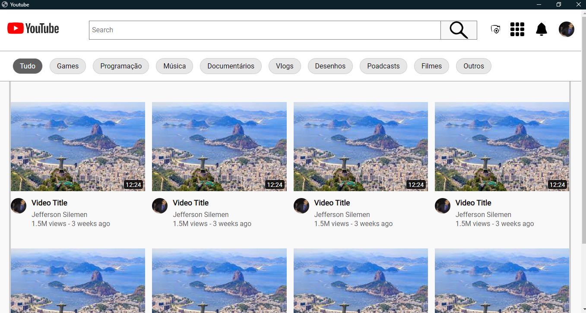

	
  

  

  

   Clone landing Page Youtube

   

  <a href="#computer-tecnologias-utilizadas">Tecnologias</a>&nbsp;&nbsp;&nbsp;|&nbsp;&nbsp;&nbsp;
  <a href="#closed_book-licença">Licença</a>

## :computer: Tecnologias utilizadas

  
  
  
  

Skills:

- HTML
- CSS

## :closed_book: Licença

Esse projeto está sob a licença MIT. Veja o arquivo [LICENSE](https://github.com/JeffersonSilemen/youtubeClone/blob/main/LICENSE) para mais detalhes.
